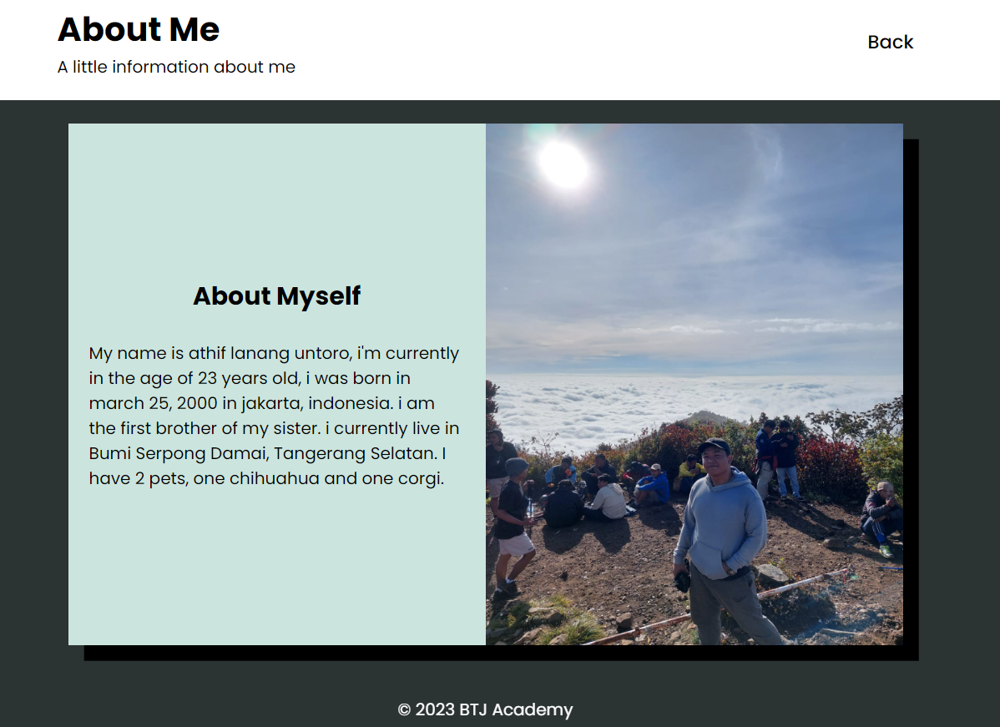

# Tugas HTML 2(7 Dec 2023)

# Login
- Page login telah diubah menyesuaikan dengan spesifikasi style yang di inginkan oleh pengajar, warna yang digunakan dipilih sesuai dengan keinginan peserta
- Posisi text yang ada pada page login mayoritas telah diletakan di posisi tengah (center) page
- Telah ditambahkan sebuah border pada bagian "Username" dan "Password" untuk membuat lebih menonjol pada desain page login
- Font yang digunakan dalam page ini adalah "Montserrat" dengan "sans-serif" sebagai font pengganti jika font Montserrat tidak ditemukan di sistem

## Before - Login

## After - Login

# About
- Page About telah di update dengan style baru dengan catatan bahwa layout header, navigation, dan footer sesuai dengan layout pada page Login
- Posisi text ditaruh di bagian tengah (center) untuk memudahkan pembaca
- Ditambahkan juga sebuah border box pada masing masing poin yang ingin ditampilkan pada page About
- Font yang digunakan dalam page ini adalah "Montserrat" dengan "sans-serif" sebagai font pengganti jika font Montserrat tidak ditemukan di sistem

## Before - About

## After - About

