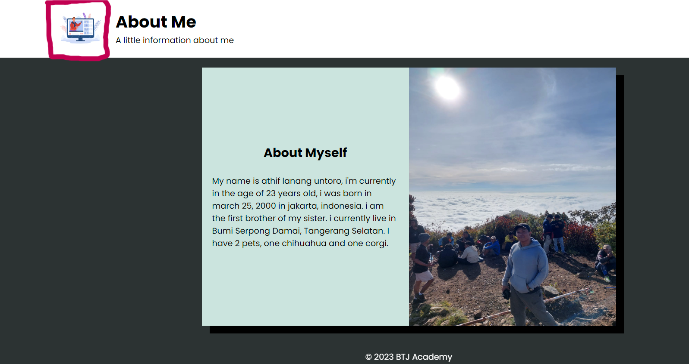

# Tugas HTML 4(13 Dec 2023)

# Login
- Page login telah diubah menyesuaikan dengan spesifikasi style yang di inginkan oleh pembuat
- Logo website yang bersebelah dengan text "welcome" dapat diputar, dapat diaktivasi saat di klik
- Telah ditambahkan checkbox show password yang terletak pada bagian bawah sign in, dapat diaktivasi saat checkbox di centang
- Login form sekarang dapat menunjukan error jika form tidak di isi, password kurang dari 6 karakter, password kurang 1 kata lower case, upper case, nomor, dan karakter special
- Setelah login form telah di isi maka page akan langsung di redirect ke page about, dapat diaktivasi setelah mengisi form dan meng klik sign in
- Login form sekarang menunjukan kalau CAPS LOCK nyala pada saat mengisi username dan password

## Before - Login

## After - Login

## After - Login - Rotate

## After - Login - Show Password

## After - Login - form validation

## After - Login - Caps Lock

# About
- Page About telah di update dengan style baru dengan catatan bahwa layout header, navigation, dan footer sesuai dengan layout pada page Login

## Before - About

## After - About

